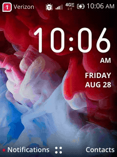

# kaimirror — scrcpy-style screen mirroring for KaiOS 3.x

Live mirroring, recording, screenshots and key injection for a KaiOS device
over adb. Tested on two TCL flip phones running KaiOS 3.x: the **Flip 3**
(`T435SP` / `Gflip7_VZW`) and the **4056S** (`Gflip5_VZW`), which is the one
in the demo below.

scrcpy itself cannot work here: KaiOS runs Gecko (`b2g`) directly on the
Android HAL, with no Android framework and no SurfaceFlinger for scrcpy's
server to bind an encoder to. kaimirror captures through b2g's own
`gfxdebugger` socket instead, and injects keys on the raw `/dev/input`
nodes — see [docs/INTERNALS.md](docs/INTERNALS.md) for how that was found
and what it costs.



*`kaimirror record --fps 10`, captured over adb at the phone's native
240x320 and driven by hand. Two cuts from one 29-second take, with the
game's load screen dropped.*

## Install

kaimirror runs on Linux and macOS. You need `adb` with root on the device
(KaiOS ships `userdebug` with `ro.debuggable=1`, so `adb root` works) and
`ffmpeg`/`ffplay` on the host — the viewer is an ffplay window. On macOS both
come from Homebrew:

```sh
brew install ffmpeg android-platform-tools
```

### Download a binary

The release is one file per platform. It **embeds the device pump**, so it
installs its own other half on first use — no NDK, no Rust, no second
download.

On Linux, that file is statically linked against musl, so it runs on any
x86-64 machine without matching a glibc:

```sh
curl -LO https://github.com/rgruesbeck/kaimirror/releases/latest/download/kaimirror-0.2.0-x86_64-linux.tar.gz
tar xzf kaimirror-0.2.0-x86_64-linux.tar.gz
./kaimirror --version
```

On macOS it is a universal binary, so the same download covers Apple silicon
and Intel:

```sh
curl -LO https://github.com/rgruesbeck/kaimirror/releases/latest/download/kaimirror-0.2.0-universal-macos.tar.gz
tar xzf kaimirror-0.2.0-universal-macos.tar.gz
./kaimirror --version
```

The binary is unsigned. `curl` leaves it alone, but a browser download picks
up a quarantine flag that Gatekeeper refuses to run; clear it with
`xattr -d com.apple.quarantine kaimirror`.

Put it on your `PATH` if you want it everywhere — `~/.local/bin` on Linux,
`/usr/local/bin` on macOS:

```sh
install -Dm755 kaimirror ~/.local/bin/kaimirror   # Linux
install -m755 kaimirror /usr/local/bin/kaimirror  # macOS
```

The release carries one `SHA256SUMS` covering both tarballs, so check the
line for the one you took:

```sh
curl -LO https://github.com/rgruesbeck/kaimirror/releases/latest/download/SHA256SUMS
grep x86_64-linux SHA256SUMS | sha256sum -c -        # Linux
grep universal-macos SHA256SUMS | shasum -a 256 -c - # macOS
```

### Build from source

Both halves are Rust, built together, on either host:

```sh
./build.sh                # device pump + host CLI
./build.sh --push         # ...and install the pump on the device
./build.sh --dist         # ...and link the host half for release, packaging dist/
```

Cross-compiling the device half needs the `armv7-linux-androideabi` target
and an NDK, found at `$ANDROID_NDK_HOME` or in the usual places — the
standalone `~/Android/android-ndk-*`, or Android Studio's
`~/Library/Android/sdk/ndk/*` on macOS. The device pump is the same ARM32
binary on both hosts; only the host half differs, and only for `--dist`,
which links against musl on Linux and `lipo`s the two Apple targets into one
universal binary on macOS:

```sh
rustup target add armv7-linux-androideabi
rustup target add x86_64-unknown-linux-musl                 # --dist on Linux
rustup target add aarch64-apple-darwin x86_64-apple-darwin  # --dist on macOS
```

The binary lands at `target/release/kaimirror`, or with `--dist` under
`target/x86_64-unknown-linux-musl/release/` (Linux) or at
`target/kaimirror-universal` (macOS), which is what a release ships alongside
the tarball and checksum it writes to `dist/`. Neither tarball can be built
on the other's host, so `--dist` leaves any tarball already in `dist/` alone
and rewrites `SHA256SUMS` over everything there: build on both machines,
collect the two files, and the checksum file covers both.

Building without the NDK works for editing the host half; the pump is then
absent and the binary says so rather than pushing a stub.

## Usage

`kaimirror --help` lists everything; each command has its own `--help`.

```sh
kaimirror view                     # live mirror window (2x, nearest-neighbour)
kaimirror view --scale 3
kaimirror record out.mp4           # Ctrl-C to finalize
kaimirror shot screen.png
kaimirror key DOWN OK              # inject key presses
kaimirror wake                     # tap power so the panel is lit
kaimirror shot --display 1 cover.png
kaimirror view --control           # drive the phone from the terminal
kaimirror view --format png        # PNG stream: 12x less bandwidth, slower
kaimirror record --fps 10 out.mp4  # lighter on the device, correctly timed
```

The capture options (`--display`, `--no-wake`, and for `view`/`record` also
`--format` and `--fps`; `--control` and `--scale` are `view` only) work on
either side of the command name, so the `kaimirror --display 1 shot cover.png`
form works too.

## Keys

`kaimirror key --list` prints them: digits `0`–`9`, `UP` `DOWN` `LEFT`
`RIGHT`, `OK`/`CENTER`, `BACK`, `MENU`, `HELP`, `CALL`/`SEND`, `STAR`,
`POUND`, `SOFT_LEFT`, `SOFT_RIGHT`, `POWER`, `VOLUMEUP`, `VOLUMEDOWN`,
`CAMERA`.

With `view --control`, terminal keystrokes are forwarded to the phone as you
type:

| Terminal | Device |
|---|---|
| arrows | UP / DOWN / LEFT / RIGHT |
| enter | OK |
| backspace | BACK |
| digits, `*`, `#` | themselves |
| `m` | MENU |
| `c` | CALL |
| `,` / `.` | left / right soft key |
| `-` / `+` | volume down / up |
| `q`, Ctrl-C | quit |

Type in the **terminal**, not the mirror window — ffplay keeps its own key
handling and offers no way to forward keystrokes. A keypress reaches the
screen in ~240 ms.

## Notes

The mirror runs at **~29 fps**, capped by `--fps`; the cap is a choice, not a
limit, and exists so the rate can be declared honestly to a video container.

`view` and `record` stream uncompressed RGB565 by default, which costs ~12x
the bandwidth of PNG (~4.4 MB/s) but is far cheaper on the device. That is
fine over USB, painful over adb-on-wifi — use `--format png` there. `shot`
always captures PNG, where colour fidelity matters and throughput does not.

If the panel is blanked, captures come back solid black; every command taps
power first unless you pass `--no-wake`.

## Files

- `kaimirror/` — host-side CLI, frame-stream reader and control channel
- `kaipump/` — device-side frame pump, statically linked for ARM32; the host
  binary embeds a copy and installs it when needed
- `build.sh` — builds both halves on Linux or macOS; `--push` also installs
  the pump, `--dist` builds the release host binary (musl static, or a
  universal binary) and packages `dist/`
- `docs/INTERNALS.md` — how capture works, the protocol, and the numbers
